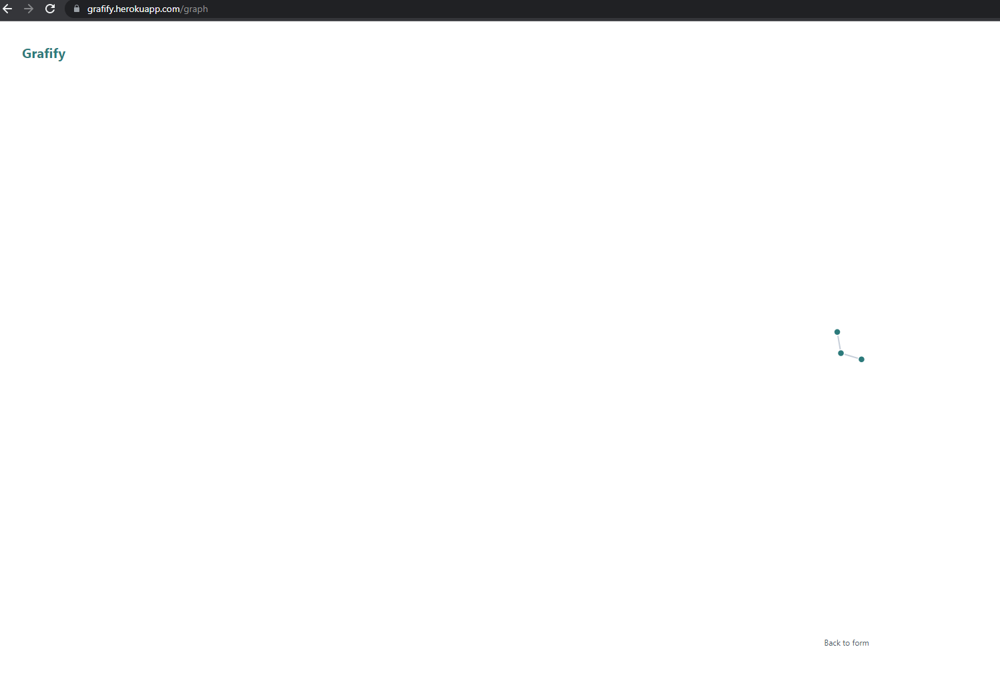
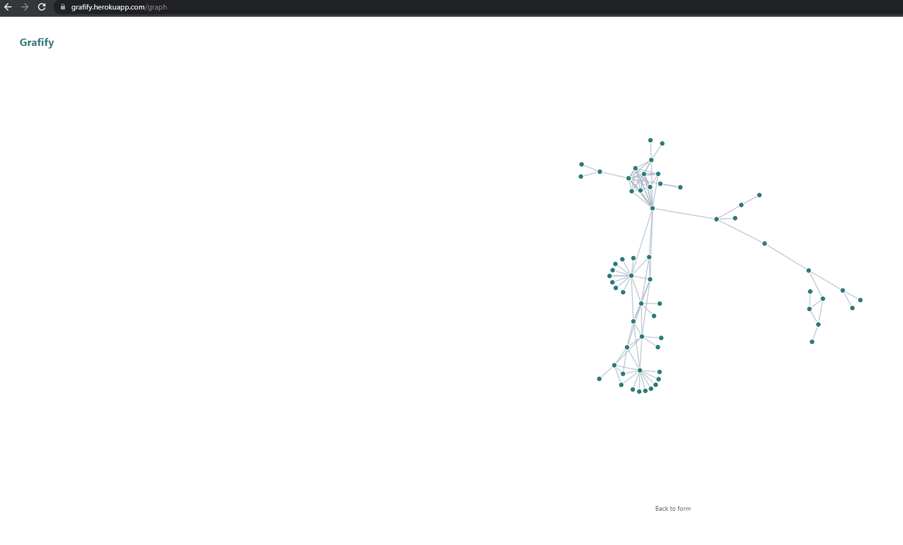

# Youtube Dependency Graph

Generate a [dependency graph](https://en.wikipedia.org/wiki/Dependency_graph) for a given Youtube video.
A given Video A is said to be dependent on Video B if the URL for Video B appears in the description of Video A.

**Example:**

[Video A](https://www.youtube.com/watch?v=iDIcydiQOhc)'s Description

> . . .
> 
> Check out the Space Time Merch Store
> https://www.pbsspacetime.com/shop
> 
> Sign up for the mailing list to get episode notifications and hear special announcements!
> https://mailchi.mp/1a6eb8f2717d/space...
> 
> Watch our original Quantum Tunneling episode here:
> https://youtu.be/-IfmgyXs7z8
> 
> Relativistic Tunneling Paper
> https://iopscience.iop.org/article/10...
> 
> Nature Paper
> https://www.nature.com/articles/s4158...
> 
> . . .

From the above description, only the link `https://youtu.be/-IfmgyXs7z8` would be treated as a dependency, as that is the only link that references a Youtube video.

**Output**

The output format is JSON, following the [JSON Grpah Format (JFG) v2](https://jsongraphformat.info/).
By following this format (with an additional `id` field in the nodes), we can easily visualize the graph using tools such as [https://grafify.herokuapp.com/](https://grafify.herokuapp.com/).

```json
{
  "id": "c84144d8-54e1-4566-9bb7-7e7b64f5e81e",
  "label": "Youtube Video Dependencies",
  "type": "ydg",
  "nodes": [
    {
      "label": "New Results in Quantum Tunneling vs. The Speed of Light",
      "id": "iDIcydiQOhc",
      "metadata": {
        "id": "iDIcydiQOhc"
      }
    },
    {
      "label": "Is Quantum Tunneling Faster than Light? | Space Time | PBS Digital Studios",
      "id": "-IfmgyXs7z8",
      "metadata": {
        "id": "-IfmgyXs7z8"
      }
    },
    {
      "label": "Is an Ice Age Coming? | Space Time | PBS Digital Studios",
      "id": "ztninkgZ0ws",
      "metadata": {
        "id": "ztninkgZ0ws"
      }
    }
  ],
  "edges": [
    {
      "id": "d4c4003e-ba38-493a-b43f-d44f1b2ceaab",
      "source": "iDIcydiQOhc",
      "target": "-IfmgyXs7z8",
      "relation": "references_via_description",
      "directed": true,
      "label": "references_via_description"
    },
    {
      "id": "d6fde2fd-6922-4661-b009-c26022fd6acf",
      "source": "-IfmgyXs7z8",
      "target": "ztninkgZ0ws",
      "relation": "references_via_description",
      "directed": true,
      "label": "references_via_description"
    }
  ]
}
```

A graph described by the JSON above is not very interesting, as it has only 3 nodes.



However if we increase the `MAX_DEPTH` from 1 to 6, we see a much more interesting graph.



In the future, the goal is to implement a full working front-end alongside this tool, allowing for custom rendering of each node, where each node will be rendered as the Thumbnail of the video.

## Build

### Requirements

* Docker

### Build the base image

```bash
> make build
v0.0.4-update-documentation-f326706-dirty
. . .
[+] Building 8.6s (12/12) FINISHED
. . .
Use 'docker scan' to run Snyk tests against images to find vulnerabilities and learn how to fix them
```

This will create a new Docker image and tag it with the name `${IMAGEORG}/${IMAGE}`, where `IMAGEORG` defaults to `tedris` and `IMAGE` defaults to `youtube-dependency-graph`.

```bash
❯ docker image ls | grep youtube
tedris/youtube-dependency-graph-build     latest                                                  61b99de82fd5   3 minutes ago   626MB
```

**Note:** The size of this docker image is quite large, as we use `--target=builder` for the `make build` target.

### Build the finalized image

```bash
❯ make finalize
v0.0.4-update-documentation-f326706-dirty
[+] Building 7.7s (12/12) FINISHED
. . .
Use 'docker scan' to run Snyk tests against images to find vulnerabilities and learn how to fix them
Ran some tests
[+] Building 1.1s (12/12) FINISHED
. . .
Use 'docker scan' to run Snyk tests against images to find vulnerabilities and learn how to fix them
```

The [`Dockerfile`](./build/docker/Dockerfile) uses a 2-stage build, with the latter stage based off `FROM scratch` and only copying in the binary file.
This vastly reduces the final size of the docker image.

```bash
❯ docker image ls | grep youtube
tedris/youtube-dependency-graph           latest                                                  17ec18e44822   2 minutes ago   11.7MB
tedris/youtube-dependency-graph           v0.0.4-update-documentation-f326706-dirty               17ec18e44822   2 minutes ago   11.7MB
tedris/youtube-dependency-graph-build     latest                                                  977a69cb8334   2 minutes ago   626MB
```

As can be seen above, the `-build` image is `626MB`, but the finalized version is only `11.7MB`.

## Usage

**Requirements**

* Docker

**Configuration**

The following is a list of available environment variables

* `API_KEY` (string, required) - Your Google Developer API Key (Must be able to access [Youtube v3 API](https://developers.google.com/youtube/v3/getting-started))
* `LOG_LEVEL` (string, `info`) - The log level to use (`dbug`, `info`, `warn`, `eror`)
* `LOG_FMT` (string, `terminalfmt`) - The log output format (`jsonfmt`, `logfmt`, `terminalfmt`)
* `MAX_DEPTH` (int, `3`) - The maximum recursion depth to search (maximum: `10`)


### Command Usage

```bash
❯ docker run -e API_KEY tedris/youtube-dependency-graph:latest help
t=2021-10-19T14:53:19+0000 lvl=warn msg="No value for VERSION found, using default" module=ydg defaultVersion=v0.0.0
NAME:
   ydg - A new cli application

USAGE:
   ydg [global options] command [command options] [arguments...]

VERSION:
   v0.0.0

COMMANDS:
   from-url    Create a dependency graph from a URL
   from-title  Create a dependency graph from a video title
   from-id     Create a dependency graph from a video title
   help, h     Shows a list of commands or help for one command

GLOBAL OPTIONS:
   --help, -h     show help (default: false)
   --version, -v  print the version (default: false)
```

The same `help` is available for each sub-command as well.

```bash
❯ docker run -e API_KEY tedris/youtube-dependency-graph:latest from-url help
t=2021-10-19T14:54:43+0000 lvl=warn msg="No value for VERSION found, using default" module=ydg defaultVersion=v0.0.0
NAME:
   ydg from-url - Create a dependency graph from a URL

USAGE:
   ydg from-url [command options] [arguments...]

OPTIONS:
   --url value  The URL of the youtube video to begin the graph with
   --help, -h   show help (default: false)
```

Running the application can be done simply by using the finalized Docker image, passing in the sub-command + args and setting the proper environment variables.

```bash
❯ docker run -e MAX_DEPTH=2 -e API_KEY tedris/youtube-dependency-graph:latest from-url --url=https://www.youtube.com/watch\?v\=iDIcydiQOhc
t=2021-10-19T14:52:06+0000 lvl=warn msg="No value for VERSION found, using default" module=ydg defaultVersion=v0.0.0
t=2021-10-19T14:52:06+0000 lvl=info msg="Generating graph for Video" module=ydg title="New Results in Quantum Tunneling vs. The Speed of Light" channel="PBS Space Time"
{"id":"25b66912-63e4-4d0f-bf99-4c52794f3473","label":"Youtube Video Dependencies","type":"ydg","nodes":[{"label":"New Results in Quantum Tunneling vs. The Speed of Light","id":"iDIcydiQOhc","metadata":{"id":"iDIcydiQOhc"}},{"label":"Is Quantum Tunneling Faster than Light? | Space Time | PBS Digital Studios","id":"-IfmgyXs7z8","metadata":{"id":"-IfmgyXs7z8"}},{"label":"Is an Ice Age Coming? | Space Time | PBS Digital Studios","id":"ztninkgZ0ws","metadata":{"id":"ztninkgZ0ws"}},{"label":"Anti-gravity and the True Nature of Dark Energy | Space Time | PBS Digital Studios","id":"UwYSWAlAewc","metadata":{"id":"UwYSWAlAewc"}},{"label":"Is energy always conserved?","id":"GHCc9b2phn0","metadata":{"id":"GHCc9b2phn0"}},{"label":"Is Math a Feature of the Universe or a Feature of Human Creation? | Idea Channel | PBS","id":"TbNymweHW4E","metadata":{"id":"TbNymweHW4E"}}],"edges":[{"id":"0202e148-4e1c-4775-95ba-f5f86680fdab","source":"iDIcydiQOhc","target":"-IfmgyXs7z8","relation":"references_via_description","directed":true,"label":"references_via_description"},{"id":"de265e2a-8b80-4e48-9f4d-a60ace1b9f9a","source":"-IfmgyXs7z8","target":"ztninkgZ0ws","relation":"references_via_description","directed":true,"label":"references_via_description"},{"id":"6a41ead8-86ec-4c9d-8c49-bc542ad7c721","source":"ztninkgZ0ws","target":"UwYSWAlAewc","relation":"references_via_description","directed":true,"label":"references_via_description"},{"id":"ce42a4ca-a56e-41bf-875d-3817201b2d5d","source":"ztninkgZ0ws","target":"GHCc9b2phn0","relation":"references_via_description","directed":true,"label":"references_via_description"},{"id":"a72b6a61-e665-435e-8304-771d902db8e7","source":"ztninkgZ0ws","target":"TbNymweHW4E","relation":"references_via_description","directed":true,"label":"references_via_description"}]}
```

## Local Development

**Requirements**

* Docker
* Docker Compose

Local development is made easy by the use of the [https://github.com/cosmtrek/air](https://github.com/cosmtrek/air) library, which enables "hot reloading" for go projects.
Refer to the provided link to learn more about the library.

```bash
❯ make up
docker-compose -f deployments/local/docker-compose.dev.yaml up -d
Creating network "local-network" with driver "bridge"
Creating app ... done
make -s logs
Attaching to app
app    |
app    |   __    _   ___
app    |  / /\  | | | |_)
app    | /_/--\ |_| |_| \_ , built with Go
app    |
app    | watching .
app    | watching app
app    | watching build
app    | watching build/docker
app    | watching cmd
app    | watching cmd/ydg
app    | watching deployments
app    | watching deployments/local
app    | watching examples
app    | watching internal
app    | watching internal/repository
app    | watching pkg
app    | watching pkg/graph
app    | watching pkg/scrape
app    | watching pkg/youtube
app    | watching secrets
app    | watching secrets/dev
app    | watching test
app    | watching test/data
app    | !exclude tmp
. . .
app    | building...
app    | running...
app    | WARN[10-19|15:09:53] No value for VERSION found, using default module=ydg defaultVersion=v0.0.0
app    | INFO[10-19|15:09:53] Generating graph for Video               module=ydg title="New Results in Quantum Tunneling vs. The Speed of Light" channel="PBS Space Time"
app    | WARN[10-19|15:09:53] Unable to get video                      module=ydg input="https://www.youtube.com/watch?v=" error="unable to create new URL from raw url https://www.youtube.com/watch?v=: ERROR: invalid input string; Unable to parse video ID out of URL; Expected format ((watch\\?v=\\S{11}){1})|(youtu\\.be\\/-?\\w{10}\\w?)|(^\\w{11}$), got result []"
app    | WARN[10-19|15:09:53] Unable to get video                      module=ydg input="http://www.youtube.com/watch?v=YWxub2XhmXM" error="no videos found with origin=http://www.youtube.com/watch?v=YWxub2XhmXM id=YWxub2XhmXM"
app    | WARN[10-19|15:09:54] Unable to get video                      module=ydg input="http://www.youtube.com/watch?v=4fQ4uB-At-c" error="no videos found with origin=http://www.youtube.com/watch?v=4fQ4uB-At-c id=4fQ4uB-At-c"
app    | <GRAPH_OUTPUT_HERE>
app    | app/config.go has changed
app    | building...
app    | running...
app    | WARN[10-19|15:11:07] No value for VERSION found, using default module=ydg defaultVersion=v0.0.0
app    | INFO[10-19|15:11:07] Generating graph for Video               module=ydg title="New Results in Quantum Tunneling vs. The Speed of Light" channel="PBS Space Time"
app    | WARN[10-19|15:11:07] Unable to get video                      module=ydg input="https://www.youtube.com/watch?v=" error="unable to create new URL from raw url https://www.youtube.com/watch?v=: ERROR: invalid input string; Unable to parse video ID out of URL; Expected format ((watch\\?v=\\S{11}){1})|(youtu\\.be\\/-?\\w{10}\\w?)|(^\\w{11}$), got result []"
app    | WARN[10-19|15:11:07] Unable to get video                      module=ydg input="http://www.youtube.com/watch?v=YWxub2XhmXM" error="no videos found with origin=http://www.youtube.com/watch?v=YWxub2XhmXM id=YWxub2XhmXM"
app    | WARN[10-19|15:11:08] Unable to get video                      module=ydg input="http://www.youtube.com/watch?v=4fQ4uB-At-c" error="no videos found with origin=http://www.youtube.com/watch?v=4fQ4uB-At-c id=4fQ4uB-At-c"
app    | <GRAPH_OUTPUT_HERE>
```

As can be seen above, the air library detected a change in `app/config.go`, triggering a re-build of the go binary, after which it ran the binary again.

The docker compose command is running in a detached state, meaning a simple `Ctrl+C` **WILL NOT** cause the command to exit.
The output shown above is the result of the `make logs` command, which uses `docker-compose logs -f app` under the hood, meaning the `Ctrl+C` simply terminates following the logs, but does not terminate the underlying container.

To properly terminate the underlying container, use the `make down` command. This will remove all resources created by the docker compose command in `make up`.

```bash
^CERROR: Aborting.
make[1]: *** [Makefile:69: logs] Error 1
make: *** [Makefile:57: up] Interrupt

❯ make down
docker-compose -f deployments/local/docker-compose.dev.yaml down
Stopping app ... done
Removing app ... done
Removing network local-network
```

## Data Model

TODO

## Deployment Procedure

TODO
